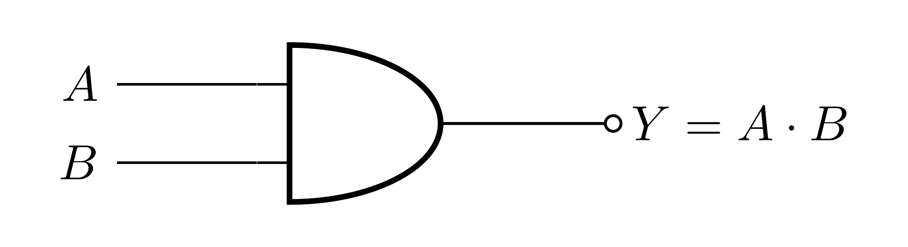
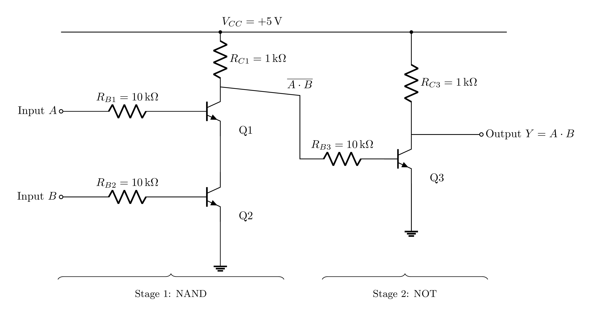

# AND Gate

An AND gate outputs `1` **only when both inputs are `1`** (`Y = A · B`).

### Symbol



### Truth table

| `A` | `B` | `Y` |
|:---:|:---:|:---:|
| 0 | 0 | 0 |
| 0 | 1 | 0 |
| 1 | 0 | 0 |
| 1 | 1 | **1** |

`Y = A · B`

---

## What `0` and `1` really mean

`0` is **not** an empty wire — it is the output **actively connected to ground (0 V)**
through a conducting transistor. `1` is the output connected to **+5 V**. A wire connected
to *nothing* is a separate, undefined **floating** state, which we always avoid.

---

## How it is built

The natural transistor gate is NAND (series transistors), so we make AND by **inverting a
NAND**:

> AND = NOT(NAND(A, B)) = A · B

- **Stage 1 — NAND:** Q1 and Q2 in series with a pull-up `R_C1`. Output = `NOT(A·B)`.
- **Stage 2 — NOT:** a single NOT gate (Q3) flips that back to `A · B`.



How it works:

- **Both A and B `1`:** stage 1 (NAND) output goes **low**, Q3 turns OFF, and the final
  output is **pulled up to +5 V** → `1`.
- **Either input `0`:** stage 1 output goes **high**, Q3 turns ON and **pulls the output to
  ground** → `0`.

So `Y = A · B`.

---

## Components

### Transistors — 2N3904  (×3: Q1, Q2, Q3)

- **Type:** **NPN** *bipolar junction transistor* (BJT) — a current-controlled switch: a
  small current into the **base** lets a much larger current flow from **collector** to
  **emitter**. Here each transistor is used fully on/off, as a switch.
- **Package:** TO-92 (small black half-cylinder of plastic with 3 legs).
- **Pinout:** hold it with the **flat face toward you and the legs pointing down** — the pins
  are **E – B – C** (Emitter, Base, Collector) from left to right.
- **Key ratings:** V_CE ≈ **40 V** max, I_C ≈ **200 mA** max, current gain *hFE* ≈ **100–300**.
- **Why NPN (not PNP)?** The NAND pair (Q1, Q2) stacks down to **ground** and the NOT gate
  (Q3) has its emitter at ground; a HIGH (+5 V) on a base turns that transistor ON. A PNP
  works the opposite way (emitter at +5 V) and would need the circuit re-wired upside-down.
- **Substitutes:** 2N2222, PN2222, BC547 — any general-purpose NPN. **Re-check the pinout.**

### Resistors

| Ref | Value | Job |
|:---:|:-----:|:----|
| R_B1, R_B2, R_B3 | **10 kΩ** | **Base resistors** — one per transistor; limit base current while switching it fully on. |
| R_C1, R_C3 | **1 kΩ**  | **Collector pull-ups** — provide the HIGH (+5 V) level for the NAND stage (`R_C1`) and the NOT-gate stage (`R_C3`). |

### Power

- A **+5 V** supply rail and a common **GND** (0 V) reference.

---

## Regenerating the diagrams

```bash
pdflatex circuit.tex
pdflatex symbol.tex
pdftoppm -png -r 600 circuit.pdf images/circuit   # -> images/circuit-1.png
pdftoppm -png -r 600 symbol.pdf  images/symbol     # -> images/symbol-1.png
```

> Use `pdftoppm`, not `pdftocairo` — at high DPI the Cairo backend can garble the fonts.
